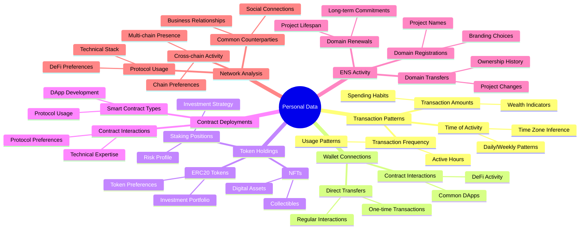

# No Privacy

[Live Demo](https://noprivacy-production.up.railway.app/)

Showcase how even small information points can be 
Gain insights into Ethereum addresses using on-chain data.

## Description

**Ethereum is not private.**

This project shows how easily meaningful insights can be derived from blockchain data, including:

- Transactions  
- Token transfers  
- Contract deployments  
- ENS domain actions (registrations, renewals)

From this data, the app estimates:

- Likely user time zones (based on timestamps)
- Linked or associated wallets

Just enter any Ethereum address to reveal insights typically unavailable on standard explorers.

## Technical Details

Data is sourced from the Blockscout API:

- General info:  
  `https://eth.blockscout.com/api/v2/addresses/{address}`

- Transactions (per chain):  
  `https://{chain}.blockscout.com/api/v2/addresses/{address}/transactions`

- Token transfers:  
  `https://{chain}.blockscout.com/api/v2/addresses/{address}/token-transfers`

- ENS data:  
  - Address lookup: `https://bens.services.blockscout.com/api/v1/1/addresses:lookup`  
  - Domain events: `https://bens.services.blockscout.com/api/v1/1/domains/{domain}/events`  
  - Domain info: `https://bens.services.blockscout.com/api/v1/1/domains/{domain}`

Timestamps from user interactions help infer time zones.  
Connections between wallets are estimated by weighting interaction patterns.

## Potential Data points

